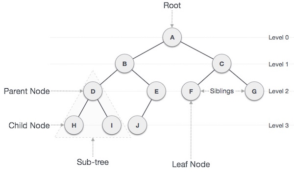

## Binary Tree

    

Binary trees are a common type of Tree. Trees are data structures that stores nodes. Similarly to linked lists, each node stores references to zero or more nodes. The fact here is that trees have a root element and structures itself as a real tree, with leafs and subtrees.
A Binary tree is just a tree with nodes that don't have more than 2 child nodes. 