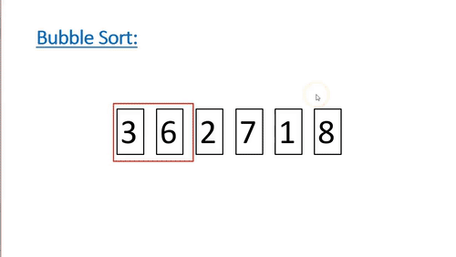

## Bubble Sort

    

Bubble Sort is one of the most basic array sorting algorithm. It consists in iterate over a array and switch places the actual element and the next element if the actual element is bigger than the next element. Iterations will end when nothing change in a full pass over the array.

#### Complexity 
##### Worst and Medium Cases: O(n²)
##### Best Cases: O(n)