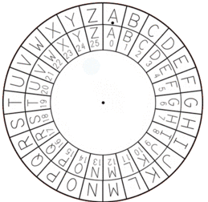

## Caesar Cipher

    

The Caesar Cipher is one of the most simple forms of encrypting messages. Dated back in the roman empire, it became famous by the usage of Julius Caesar, who used it to cover military and strategic messages.
The Caesar Cipher takes a input named plaintext and a shift number. The shift number means a shift in the alphabet, where each letter will have its equivalent. After that, just use the new alphabet to match the letters and form the cyphertext or output.
Because its simplicity, the Caesar Cipher is a good way to understand the basics of encrypting algorithms and its usage in practical ways. 
