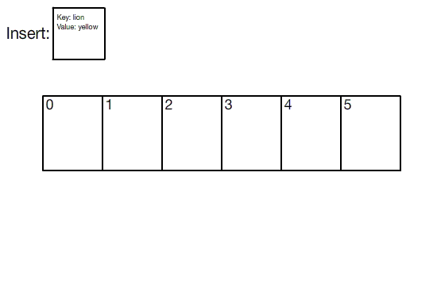

## Hash Table

    

Hash Table is a data structure that unites the best of arrays and linked lists. By combining the indexing of lists with the pointer progression of linked lists, it builds a table that accepts nodes composed of key/value pairs that are distributed in a array of linked lists.

The index of each element is calculated by passing its key to a hash function. The hash function has the responsibility to transform keys into indexes to put the new element in the linked list contained in that element. It is very important that the hash algorithm has the capacity to uniformy distribute the elements so that the most part of indexes own similar ammounts of elements.

#### Complexity 

| Algorithm | Average Case | Worst Case |
|-----------|--------------|------------|
|  Search   |   O(1)       |  O(log n)  |
|  Insert   |   O(1)       |  O(log n)  |
|  Delete   |   O(1)       |  O(log n)  |