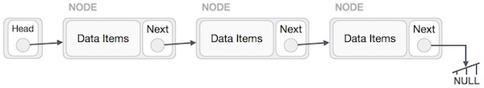

## Linked List

    

Linked List is a data structure that is, in certain point, a advanced version of simple lists. Linked lists elements consists of Nodes, and besides the actual value, each node stores a reference to the next node (commonly this reference is a pointer).
With that approach, the linked list can be itterated without the need of a solid array, only with the pointer references of the nodes. As a pattern, the last node stores a null reference.
Linked lists are commonly implemented with Insert, Search, Delete and Reverse methods. It contain a Head attribute too, which acts as a reference to the first element of the node chain.