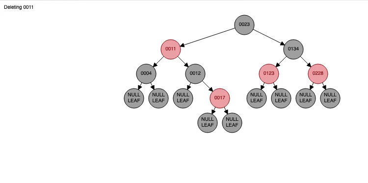

## Red Black Tree

    

Red Black Trees (RBTrees) are, along with AVL Trees, the main form of balancing binary trees. It uses a system of coloring to properly balance the nodes. To conquer that, a few rules need to be followed:

- Every node has a color red or black
- The root node is always black
- If a node is red, its two childs have to be black
- Every path from a node to a descendant leaf contains the same ammount of black nodes.

Compared to AVL, RBTrees are more valuable in operations like insert and delete. Because AVL Trees do more rotations in these operations, this cost more processing, slowing down the overall performance. However, this makes the tree more balanced, causing searching methods to act with more performance than RBTrees.

#### Complexity 

| Algorithm | Average Case | Worst Case |
|-----------|--------------|------------|
|  Search   |   O(log n)   |  O(log n)  |
|  Insert   |   O(log n)   |  O(log n)  |
|  Delete   |   O(log n)   |  O(log n)  |